# AstaVet ECC configuration graph

Generated from `config/ecc/harness.json`. Run `node scripts/ecc-harness.mjs graph --write`.

```mermaid
flowchart LR
  inspect["inspect"]
  implement["implement"]
  inspect --> implement
  verify["verify"]
  implement --> verify
  route_java["java"]
  inspect --> route_java
  route_java --> skill_java_coding_standards["java-coding-standards"]
  route_java -. "when needed" .-> skill_springboot_tdd["springboot-tdd"]
  route_java -. "when needed" .-> skill_springboot_patterns["springboot-patterns"]
  route_java -. "when needed" .-> skill_springboot_verification["springboot-verification"]
  route_java --> role_java_reviewer["role: java_reviewer"]
  route_java --> role_java_build_resolver["role: java_build_resolver"]
  route_java --> rule_docs_ecc_rules_java_coding_style_md["java/coding-style.md"]
  route_java --> rule_docs_ecc_rules_java_security_md["java/security.md"]
  route_java --> check_backend["verify backend"]
  route_java_tests["java_tests"]
  inspect --> route_java_tests
  route_java_tests --> skill_springboot_tdd["springboot-tdd"]
  route_java_tests --> role_java_reviewer["role: java_reviewer"]
  route_java_tests --> rule_docs_ecc_rules_java_testing_md["java/testing.md"]
  route_java_tests --> check_backend["verify backend"]
  route_persistence["persistence"]
  inspect --> route_persistence
  route_persistence --> skill_jpa_patterns["jpa-patterns"]
  route_persistence -. "when needed" .-> skill_postgres_patterns["postgres-patterns"]
  route_persistence --> role_java_reviewer["role: java_reviewer"]
  route_persistence --> check_integration["verify integration"]
  route_api["api"]
  inspect --> route_api
  route_api --> skill_api_design["api-design"]
  route_api -. "when needed" .-> skill_security_review["security-review"]
  route_api --> role_security_reviewer["role: security_reviewer"]
  route_api --> check_backend["verify backend"]
  route_migration["migration"]
  inspect --> route_migration
  route_migration --> skill_database_migrations["database-migrations"]
  route_migration --> skill_postgres_patterns["postgres-patterns"]
  route_migration --> role_java_reviewer["role: java_reviewer"]
  route_migration --> check_backend["verify backend"]
  route_migration --> check_integration["verify integration"]
  route_security["security"]
  inspect --> route_security
  route_security --> skill_springboot_security["springboot-security"]
  route_security -. "when needed" .-> skill_security_review["security-review"]
  route_security --> role_security_reviewer["role: security_reviewer"]
  route_security --> rule_docs_ecc_rules_java_security_md["java/security.md"]
  route_security --> check_backend["verify backend"]
  route_frontend["frontend"]
  inspect --> route_frontend
  route_frontend --> skill_verification_loop["verification-loop"]
  route_frontend -. "when needed" .-> skill_tdd_workflow["tdd-workflow"]
  route_frontend --> role_explorer["role: explorer"]
  route_frontend --> check_frontend["verify frontend"]
  route_harness["harness"]
  inspect --> route_harness
  route_harness --> skill_agent_harness_construction["agent-harness-construction"]
  route_harness -. "when needed" .-> skill_eval_harness["eval-harness"]
  route_harness --> role_harness_optimizer["role: harness_optimizer"]
  route_harness --> check_ecc["verify ecc"]
```

Baseline: common coding-style, security and testing. Java adds coding-style/security; Java test files add testing.

Dashed skill edges are conditional: activate only when their task trigger applies. Verification includes diff review.

Role definitions: `.codex/agents/`. Selection prints required guidance and checks; it does not execute commands or spawn agents.
